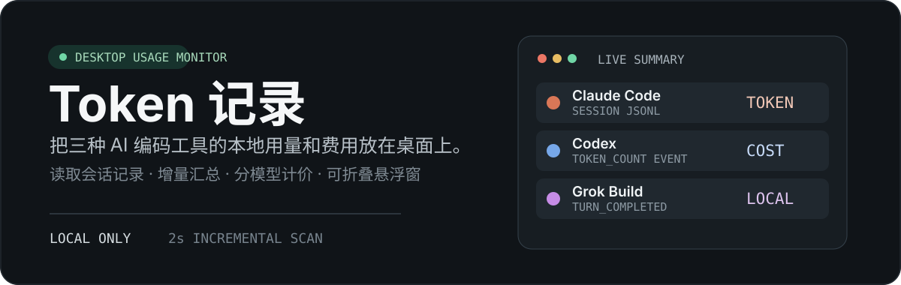
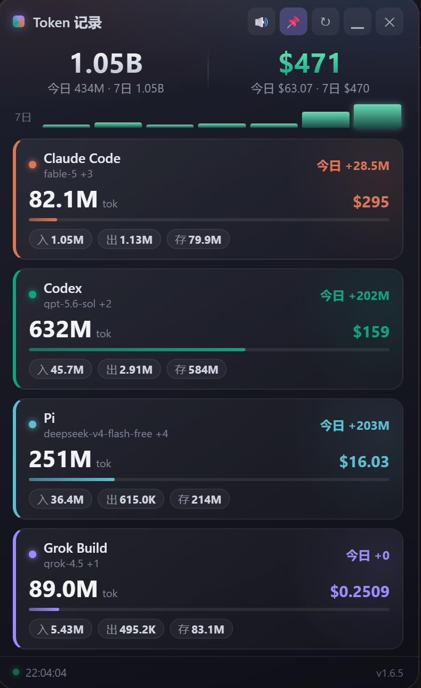
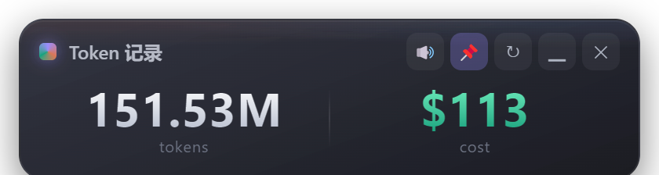

<div align="center">
  
</div>

<p align="center">
  <a href="https://github.com/hkm-a/token-record/releases">
    
  </a>
  <a href="LICENSE">
    
  </a>
  <a href="https://github.com/hkm-a/token-record/releases">
    
  </a>
  
  
  
</p>

---

**当前版本：v1.6.6** · [Releases](https://github.com/hkm-a/token-record/releases/tag/v1.6.6)

本地优先的桌面悬浮窗：汇总 **Claude Code**、**Codex**、**Pi**、**Grok Build** 的 token 消耗与估算费用，数值变化带动效。无需账号、不上云。



折叠态（标题栏「▁」）：仅两个大数字指标。



---

## 30 秒上手

1. 从 [Releases](https://github.com/hkm-a/token-record/releases) 下载 `TokenRecord-*-portable.exe`
2. 双击运行 → 右上角悬浮窗 + 托盘图标
3. 若四源皆空：先用过对应 AI 编码工具产生本地会话后再看

开发模式：

```bash
npm install
npm start          # 悬浮窗
npm run cli        # 终端汇总（含数据源状态）
npm test           # 单元测试
npm run pack       # 打 Windows 便携包 → dist/
```

---

## 它解决什么问题

AI 编码工具的用量分散在各自本地会话里，难以横向比较。本工具只读本机会话文件，按模型单价汇总 token 与费用，并以可折叠悬浮窗常驻桌面。

---

## 功能一览

| 能力 | 说明 |
|------|------|
| 四源采集 | Claude / Codex / Pi / Grok Build 本地 JSONL |
| 分项计价 | 输入 / 输出 / 缓存写 / 缓存读；可覆盖单价 |
| 今日 / 近 7 日 | 总览副行 + 7 日火花条；各工具卡右上角「今日」 |
| 折叠迷你条 | 「▁」后只保留总 Tokens / 总花费两大数字 |
| 导出 CSV | 托盘菜单或 `npm run cli -- --csv out.csv` |
| 系统托盘 | 显示隐藏、刷新、价目、检查更新、开机自启、退出 |
| 关窗进托盘 | ✕ = 隐藏；退出走托盘 |
| 位置记忆 | 拖动后重启仍在原处；高度随内容收紧 |
| 源状态提示 | 目录缺失 / 无会话时可见，不装傻显示全 0 |
| 便携包 | 无需安装 Node 即可运行 |
| 自动更新 | 启动静默检查 GitHub Release；托盘可下载 portable |

---

## 数据源路径

| 工具 | 默认路径 | 内容 |
|------|----------|------|
| Claude Code | `~/.claude/projects/*/*.jsonl` | `message.usage` |
| Codex | `~/.codex/sessions/**/*.jsonl` | `token_count` |
| Pi | `~/.pi/agent/sessions/**/*.jsonl` | `message.usage` |
| Grok Build | `~/.grok/sessions/**/updates.jsonl` | `turn_completed.usage` |

可用环境变量覆盖根目录：`TOKENREC_CLAUDE_DIR` / `TOKENREC_CODEX_DIR` / `TOKENREC_PI_DIR` / `TOKENREC_GROK_DIR`。

**只读**：从不修改或上传会话文件；计算全在本地。

---

## 托盘菜单

| 项 | 作用 |
|----|------|
| 显示 / 隐藏 | 切换悬浮窗 |
| 立即刷新 | 立刻重扫会话 |
| 导出 CSV… | 写入「下载」并定位 |
| 打开价目覆盖文件 | `~/.token-record/pricing.override.json` |
| 检查更新… | 查询 GitHub 最新版；可下载 portable 到「下载」文件夹 |
| 开机自启 | 登录后静默启动（托盘常驻） |
| 退出 | 结束进程 |

启动约 12 秒后会**静默**检查更新；有新版本才弹窗。便携版无法覆盖正在运行的文件，下载后请退出再运行新 exe。

---

## 定价

内置表：`src/pricing/pricing.json`（美元 / 百万 token）。

推荐覆盖（不改仓库）：

```text
~/.token-record/pricing.override.json
```

```json
{
  "models": {
    "claude-opus-4": { "input": 15, "output": 75, "cacheWrite": 18.75, "cacheRead": 1.5 }
  }
}
```

环境变量：`TOKENREC_PRICING_OVERRIDE`。  
无公开价的自定义模型会**估算**并在界面标注。

---

## 周期与导出

```bash
npm run cli
npm run cli -- --csv .cache/export.csv
```

- 快照字段：`period.today` / `period.last7` / `byDay` / `sources`
- 按日历史：`.cache/daily.json`（约 90 天）

> **v1.6.5+**：历史持久化至 `%APPDATA%/token-record/history.json`，不受本地会话文件清理影响，终身累计。

> **v1.6.6+**：首次刷新会校正当前仍可见的 Codex 会话重放计数，并在同目录保留 `history.pre-v1.6.6.json` 备份；已被源工具清理的旧日期无法可靠重算，继续保留原记录。

---

## 产品边界（明确不做）

本产品有意保持小而完整，**不包含**：

- 云同步、账号登录、多设备
- 手机端 / 浏览器扩展
- 更多工具采集（Cursor 等留待后续版本评估）
- 官方账单 API 对账（仅本地会话估算）
- 团队协作、分享、后台服务

真实需求出现时，应作为独立能力设计，而不是塞进悬浮窗。

---

## 验证

```bash
npm test
npm run cli
```

测试覆盖：采集器、聚合去重、按日 period、价目覆盖、偏好、数据源健康检查、历史持久化。

---

## 架构

```
src/
├── shared/       # 路径、JSONL、文件遍历
├── collectors/   # claude / codex / pi / grok
├── pricing/      # pricing.json + calculator
├── core/         # aggregator / store / sources
├── cli.js
├── main/         # Electron 主进程、托盘、偏好
└── renderer/     # 悬浮窗 UI
```

> **v1.6.0+** 后端已由 Rust 重写（Tauri v2），前端仍然 `src/renderer/`。
> CLI 二进制 `trcli`（569KB）与 JS CLI 输出一致。

---

## 许可证

MIT · Copyright © 2026 hkm-a
